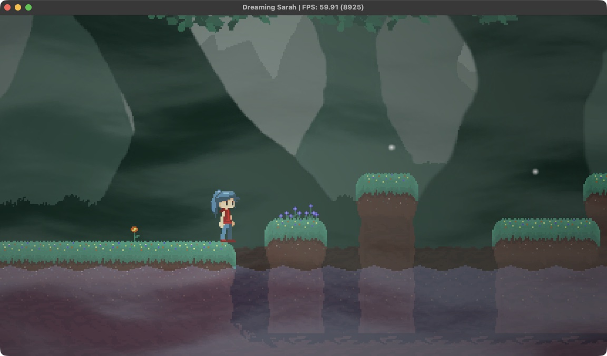
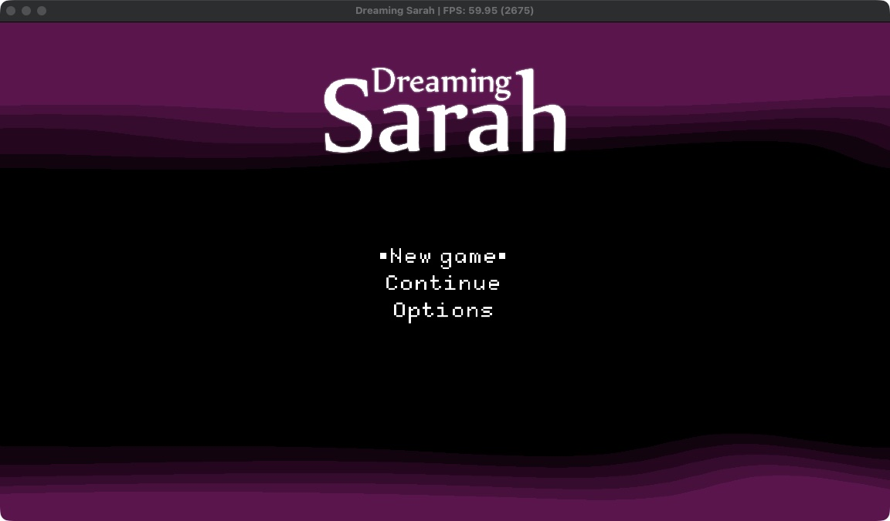
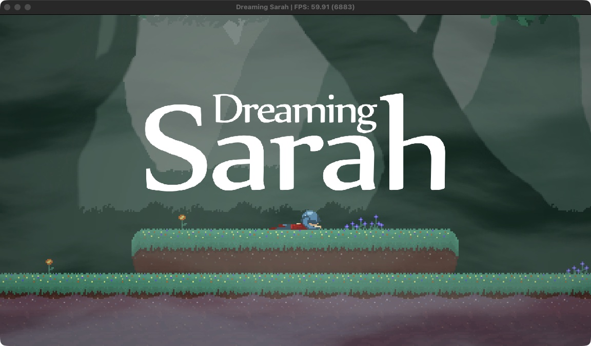

# AnyPS5-ARM

**Run PS5 games natively on Apple silicon Macs.**

[English](#english) · [Türkçe](#türkçe)



<p align="center"><sub>Dreaming Sarah (PPSA02929) on a MacBook Pro M3 Pro, macOS 26.6.2. The FPS counter is in the window title.</sub></p>

---

## English

AnyPS5-ARM is the macOS port of [AnyPS5](https://github.com/boykopovar/AnyPS5). AnyPS5 is not an emulator. Its relinker turns a PS5 executable into a native program, and its system libraries are reimplemented as ordinary shared libraries the program links against. This fork makes that work on Apple silicon:

- **CPU:** the game's x86-64 code runs under **Rosetta 2**.
- **Executable:** the relinker writes a **Mach-O** executable.
- **Graphics:** the PS5 graphics driver runs on **Vulkan through MoltenVK**, which runs on Metal.
- **Distribution:** the result is packaged as a normal **`.app`** you open from Finder.

### Status

| Check | Result |
|---|---|
| Dreaming Sarah (PPSA02929), menu and gameplay | **60 fps** (about 18 fps before the macOS write watch) |
| Breakout test title (video, pad, audio) | 60 fps |
| Guest fixtures (TLS, exceptions, threads, modules) | 10 of 10 pass |
| Test suite on MoltenVK | 477 of 484 pass |

Measured on a MacBook Pro M3 Pro running macOS 26.6.2 with Vulkan SDK 1.4.363.0. The 7 failing tests hit Apple GPU or Metal limits, such as 64-bit buffer atomics and 32 KiB threadgroup memory. [docs/dev/MACOS_PORT.md](docs/dev/MACOS_PORT.md) lists them, along with every change this fork makes.

| Main menu | Opening scene |
|---|---|
|  |  |

### Requirements

- A Mac with Apple silicon (M1 or newer)
- Rosetta 2: `softwareupdate --install-rosetta --agree-to-license`
- Xcode command-line tools: `xcode-select --install`
- CMake and Ninja: `brew install cmake ninja`
- The [Vulkan SDK for macOS](https://vulkan.lunarg.com/sdk/home#mac), which provides the Vulkan loader and MoltenVK
- A **decrypted dump of a game you own**. It needs a plain ELF executable; a signed SELF does not work.

### 1. Build

```sh
git clone --recursive https://github.com/utkuhalis/AnyPS5-ARM.git
cd AnyPS5-ARM
cmake -S . -B build-mac -G Ninja -DCMAKE_BUILD_TYPE=Release -DCMAKE_OSX_ARCHITECTURES=x86_64
ninja -C build-mac all libs
```

`CMAKE_OSX_ARCHITECTURES=x86_64` is required, because the system libraries have to match the game's x86-64 code. The build produces:

- the relinker at `build-mac/core/relinker/relinker`
- the system libraries in `build-mac/core/libs/libs/`

### 2. Convert a game

The dump folder holds the executable, its bundled modules and the game's data:

```text
MyGame/
    eboot.bin        decrypted ELF executable
    sce_module/      the game's bundled modules (libc.prx, ...)
    sce_sys/         param.json, icon0.png, ...
    ...              the game's data files
```

Relink the executable for macOS:

```sh
build-mac/core/relinker/relinker --macos --to-intel MyGame/eboot.bin out/eboot
```

- `--macos` writes a Mach-O executable.
- `--to-intel` rewrites the AMD-only instructions that Rosetta cannot run.
- The converted modules are written to `out/app0/sce_module/`.

### 3. Package it as an app

```sh
python3 tools/package_macos_app.py \
    --relinked out \
    --game MyGame \
    --libs build-mac/core/libs/libs \
    --vulkan ~/VulkanSDK/<version>/macOS \
    "My Game.app"
```

The bundle contains everything it needs: the game, the system libraries, the Vulkan loader and MoltenVK. Its name and icon come from `sce_sys/param.json` and `icon0.png`. You can move it to `/Applications` and start it from Finder or Launchpad.

The app is not signed. If macOS refuses to open it, right-click it and choose **Open** once.

### 4. Play

| Keyboard / mouse | PS5 button |
|---|---|
| Arrow keys | D-pad |
| W A S D | Left stick |
| T F G H | Right stick |
| Return or Space | Cross |
| C | Circle |
| I | Triangle |
| Left click | Square |
| Q / E (or Alt) | L1 / R1 |
| Right click | R2 |
| Left Shift / Left Ctrl | L3 / R3 |
| Escape | Options |
| Backspace / Tab | Touchpad left / right |
| F11 | Toggle fullscreen |

Controllers that SDL recognizes, such as DualSense, DualShock and Xbox pads, work automatically. To change the keyboard and mouse bindings, see [INPUT_MAPPING.md](docs/user/INPUT_MAPPING.md).

### Troubleshooting

- **Log:** `~/Library/Logs/AnyPS5/<TITLE ID>.log`. When a game stops, the reason is at the end of this file. Unsupported states always end the program with an error message rather than continuing silently.
- **Shader cache:** `~/Library/Caches/org.anyps5.<title id>/shader_cache`. The first run compiles shaders, so it can stutter; later runs load them from the cache.
- **Performance profile:** start the executable from a terminal with `APS5_PROFILE_DRAW=1`. Every 10 seconds the log gets a `[present]` line with the number of frames drawn and the GPU time per frame.

### Limitations

- The game's code runs under Rosetta 2. Apple has announced that macOS 27 is the last release with full Rosetta support.
- Only Dreaming Sarah has been verified on macOS so far. Other games may stop at a function or GPU feature that is not implemented yet.
- MoltenVK has no geometry shaders, mesh shaders or 64-bit floats, so games that need them will not run.
- Known costs of the macOS port are listed in [TechnicalDebt.md](docs/dev/TechnicalDebt.md).

### Documentation

- [macOS port: status and changes](docs/dev/MACOS_PORT.md)
- [Relinker usage](docs/user/USAGE.md)
- [Input mapping](docs/user/INPUT_MAPPING.md)
- [Architecture](docs/dev/ARCHITECTURE.md)
- [Technical debt](docs/dev/TechnicalDebt.md)
- [Code conventions](docs/dev/CONVENTIONS.md)

### Credits

- [boykopovar/AnyPS5](https://github.com/boykopovar/AnyPS5): the relinker, the system libraries and the shader recompiler this fork is built on.
- [mugurc/AnyPS5 `macos-port`](https://github.com/mugurc/AnyPS5/tree/macos-port): the community macOS port that added Mach-O output, merged here.

---

## Türkçe

AnyPS5-ARM, [AnyPS5](https://github.com/boykopovar/AnyPS5)'in macOS sürümüdür. AnyPS5 bir emülatör değildir. Relinker'ı PS5 oyun dosyasını yerel bir programa dönüştürür. Sistem kütüphaneleri de yeniden yazılmıştır ve program bunlara normal paylaşımlı kütüphaneler gibi bağlanır. Bu fork, bunu Apple silicon'da çalışır hale getirir:

- **İşlemci:** Oyunun x86-64 kodu **Rosetta 2** altında çalışır.
- **Çalıştırılabilir dosya:** Relinker, oyunu bir **Mach-O** dosyası olarak yazar.
- **Grafik:** PS5 grafik sürücüsü, **MoltenVK üzerinden Vulkan** ile çalışır. MoltenVK da Metal'i kullanır.
- **Dağıtım:** Sonuç, Finder'dan açılan normal bir **`.app`** olarak paketlenir.

### Durum

| Kontrol | Sonuç |
|---|---|
| Dreaming Sarah (PPSA02929), menü ve oynanış | **60 FPS** (macOS yazma izleme eklenmeden önce ~18 FPS) |
| Breakout test oyunu (görüntü, kol, ses) | 60 FPS |
| Misafir testleri (TLS, istisnalar, thread'ler, modüller) | 10/10 geçiyor |
| MoltenVK üzerinde test paketi | 484 testin 477'si geçiyor |

Ölçümler macOS 26.6.2 çalışan bir MacBook Pro M3 Pro'da, Vulkan SDK 1.4.363.0 ile yapıldı. Geçmeyen 7 test, Apple GPU'sunun veya Metal'in sınırlarına takılıyor; örneğin 64-bit buffer atomikleri ve 32 KiB threadgroup belleği. [docs/dev/MACOS_PORT.md](docs/dev/MACOS_PORT.md) bu testleri ve bu fork'un yaptığı tüm değişiklikleri listeler.

| Ana menü | Açılış sahnesi |
|---|---|
|  |  |

### Gereksinimler

- Apple silicon işlemcili bir Mac (M1 veya daha yenisi)
- Rosetta 2: `softwareupdate --install-rosetta --agree-to-license`
- Xcode komut satırı araçları: `xcode-select --install`
- CMake ve Ninja: `brew install cmake ninja`
- [macOS için Vulkan SDK](https://vulkan.lunarg.com/sdk/home#mac); Vulkan yükleyicisini ve MoltenVK'yi sağlar
- **Sahip olduğun bir oyunun şifresi çözülmüş dump'ı.** Çalıştırılabilir dosya düz bir ELF olmalı; imzalı SELF çalışmaz.

### 1. Derleme

```sh
git clone --recursive https://github.com/utkuhalis/AnyPS5-ARM.git
cd AnyPS5-ARM
cmake -S . -B build-mac -G Ninja -DCMAKE_BUILD_TYPE=Release -DCMAKE_OSX_ARCHITECTURES=x86_64
ninja -C build-mac all libs
```

`CMAKE_OSX_ARCHITECTURES=x86_64` zorunlu, çünkü sistem kütüphanelerinin oyunun x86-64 koduyla aynı mimaride olması gerekiyor. Derleme şunları üretir:

- relinker: `build-mac/core/relinker/relinker`
- sistem kütüphaneleri: `build-mac/core/libs/libs/`

### 2. Oyunu dönüştürme

Dump klasöründe çalıştırılabilir dosya, oyunla gelen modüller ve oyunun verileri bulunur:

```text
MyGame/
    eboot.bin        şifresi çözülmüş ELF
    sce_module/      oyunla gelen modüller (libc.prx, ...)
    sce_sys/         param.json, icon0.png, ...
    ...              oyunun veri dosyaları
```

Çalıştırılabilir dosyayı macOS için dönüştür:

```sh
build-mac/core/relinker/relinker --macos --to-intel MyGame/eboot.bin out/eboot
```

- `--macos`, Mach-O dosyası üretir.
- `--to-intel`, Rosetta'nın çalıştıramadığı AMD'ye özel komutları dönüştürür.
- Dönüştürülen modüller `out/app0/sce_module/` klasörüne yazılır.

### 3. Uygulama olarak paketleme

```sh
python3 tools/package_macos_app.py \
    --relinked out \
    --game MyGame \
    --libs build-mac/core/libs/libs \
    --vulkan ~/VulkanSDK/<sürüm>/macOS \
    "My Game.app"
```

Paket, çalışmak için gereken her şeyi içerir: oyun, sistem kütüphaneleri, Vulkan yükleyicisi ve MoltenVK. Adı ve simgesi `sce_sys/param.json` ile `icon0.png`'den alınır. Uygulamayı `/Applications` klasörüne taşıyıp Finder'dan ya da Launchpad'den açabilirsin.

Uygulama imzasız. macOS açmayı reddederse, uygulamaya sağ tıklayıp bir kere **Aç**'ı seç.

### 4. Oynama

| Klavye / fare | PS5 tuşu |
|---|---|
| Yön tuşları | D-pad |
| W A S D | Sol analog |
| T F G H | Sağ analog |
| Return veya Space | Çarpı (Cross) |
| C | Daire (Circle) |
| I | Üçgen (Triangle) |
| Sol tık | Kare (Square) |
| Q / E (veya Alt) | L1 / R1 |
| Sağ tık | R2 |
| Sol Shift / Sol Ctrl | L3 / R3 |
| Escape | Options |
| Backspace / Tab | Touchpad sol / sağ |
| F11 | Tam ekran aç/kapat |

SDL'in tanıdığı kollar (DualSense, DualShock, Xbox kolları gibi) kendiliğinden çalışır. Klavye ve fare tuşlarını değiştirmek için [INPUT_MAPPING.md](docs/user/INPUT_MAPPING.md) dosyasına bak.

### Sorun giderme

- **Log:** `~/Library/Logs/AnyPS5/<TITLE ID>.log`. Oyun kapanırsa sebebi bu dosyanın sonunda yazar. Desteklenmeyen bir durumda program sessizce devam etmez, her zaman bir hata mesajıyla kapanır.
- **Shader önbelleği:** `~/Library/Caches/org.anyps5.<title id>/shader_cache`. İlk açılışta shader'lar derlendiği için takılmalar olabilir; sonraki açılışlarda önbellekten yüklenir.
- **Performans ölçümü:** Çalıştırılabilir dosyayı terminalden `APS5_PROFILE_DRAW=1` ile başlat. Log dosyasına her 10 saniyede bir `[present]` satırı düşer; bu satırda çizilen kare sayısı ve kare başına GPU süresi yazar.

### Sınırlamalar

- Oyun kodu Rosetta 2 altında çalışıyor. Apple, macOS 27'nin tam Rosetta desteği olan son sürüm olacağını duyurdu.
- macOS'ta şimdilik yalnızca Dreaming Sarah doğrulandı. Diğer oyunlar, henüz yazılmamış bir fonksiyona ya da GPU özelliğine takılıp durabilir.
- MoltenVK'de geometry shader, mesh shader ve 64-bit float yok; bunlara ihtiyaç duyan oyunlar çalışmaz.
- macOS sürümünün bilinen maliyetleri [TechnicalDebt.md](docs/dev/TechnicalDebt.md) dosyasında listelenir.

### Belgeler

- [macOS sürümü: durum ve değişiklikler](docs/dev/MACOS_PORT.md)
- [Relinker kullanımı](docs/user/USAGE.md)
- [Tuş atamaları](docs/user/INPUT_MAPPING.md)
- [Mimari](docs/dev/ARCHITECTURE.md)
- [Teknik borç](docs/dev/TechnicalDebt.md)
- [Kod kuralları](docs/dev/CONVENTIONS.md)

### Teşekkürler

- [boykopovar/AnyPS5](https://github.com/boykopovar/AnyPS5): Bu fork'un temeli olan relinker, sistem kütüphaneleri ve shader derleyicisi.
- [mugurc/AnyPS5 `macos-port`](https://github.com/mugurc/AnyPS5/tree/macos-port): Mach-O çıktısını ekleyen topluluk macOS sürümü; buraya birleştirildi.

---

## Disclaimer / Yasal uyarı

This project is intended for interoperability, research, preservation and compatibility purposes. It does not include, distribute or require copyrighted software, firmware, cryptographic keys or proprietary libraries. Users are responsible for obtaining and using any binaries with this project in accordance with applicable laws and their license terms.

Bu proje birlikte çalışabilirlik, araştırma, koruma ve uyumluluk amaçlıdır. Telif hakkıyla korunan yazılım, firmware, şifreleme anahtarı veya kapalı kaynaklı kütüphane içermez, dağıtmaz ve gerektirmez. Bu projeyle kullanılan dosyaların yasalara ve lisans koşullarına uygun şekilde edinilmesi ve kullanılması kullanıcının sorumluluğundadır.

## License / Lisans

GNU General Public License version 2 only.
