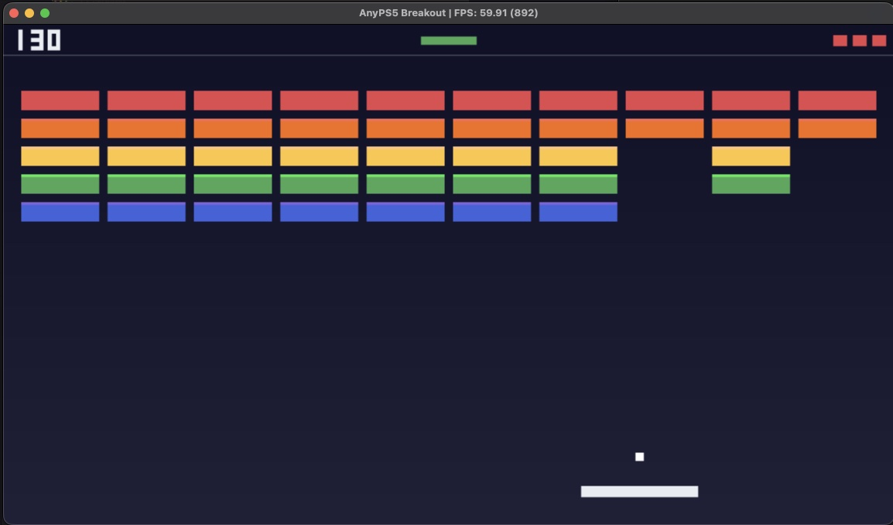
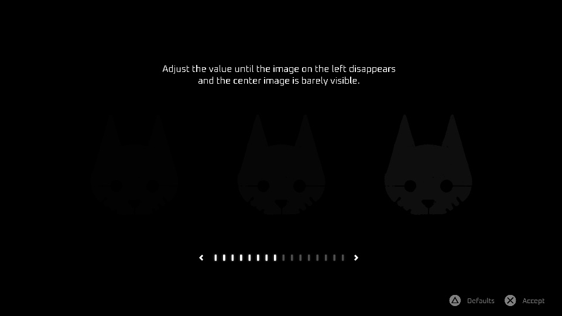

# AnyPS5-ARM

**Run PS5 games natively on Apple silicon Macs.**

[Full guide in English and Turkish / Türkçe rehber](docs/user/GUIDE.md)

## These three games run on a Mac

| Dreaming Sarah | AnyPS5 Breakout | Stray · 🚧 WIP |
|---|---|---|
|  |  |  |
| 60 fps, playable | 60 fps, test title | about 1 fps, **work in progress**: boots to the brightness setup screen |

MacBook Pro M3 Pro, macOS 26.6.2. Stray is the first Unreal Engine 4 title to render here; see [where it stands](docs/user/GUIDE.md#stray-work-in-progress).

## Compatibility

[Tested games and their frame rates](docs/user/COMPATIBILITY.md)

## Status

 

* System libraries: the share of the functions the project knows so far (declared in [core/libs/prx](core/libs/prx)) that are implemented, not of every PS5 system function.

## The AnyPS5 app

**AnyPS5.app** turns a game folder into a Mac app in four clicks: no Terminal, no build. [⬇ Download](https://github.com/utkuhalis/AnyPS5-ARM/releases/latest/download/AnyPS5-macOS.zip) · [How to use it](docs/user/GUIDE.md#the-anyps5-app)

## About

AnyPS5-ARM is the macOS port of [AnyPS5](https://github.com/boykopovar/AnyPS5). AnyPS5 is not an emulator: its relinker turns a PS5 executable into a native program, and its system libraries are reimplemented as ordinary shared libraries the program links against. On Apple silicon:

- **CPU:** the game's x86-64 code runs under **Rosetta 2**. A [native arm64 mode](https://github.com/utkuhalis/AnyPS5-ARM/blob/native-arm64/docs/dev/NATIVE_ARM64.md) without Rosetta is in development on the `native-arm64` branch.
- **Executable:** the relinker writes a **Mach-O** executable.
- **Graphics:** the PS5 graphics driver runs on **Vulkan through MoltenVK**, which runs on Metal.
- **Distribution:** the result is a normal **`.app`** you open from Finder.

[Building from source](docs/user/GUIDE.md#building-from-source) · [macOS port changes](docs/dev/MACOS_PORT.md) · [Input mapping](docs/user/INPUT_MAPPING.md) · [Technical debt](docs/dev/TechnicalDebt.md)

Built on [boykopovar/AnyPS5](https://github.com/boykopovar/AnyPS5) and the community macOS port [mugurc/AnyPS5 `macos-port`](https://github.com/mugurc/AnyPS5/tree/macos-port).

## Disclaimer

This project is intended for interoperability, research, preservation and compatibility purposes. It does not include, distribute or require copyrighted software, firmware, cryptographic keys or proprietary libraries. Users are responsible for obtaining and using any binaries with this project in accordance with applicable laws and their license terms.

## License

GNU General Public License version 2 only.
