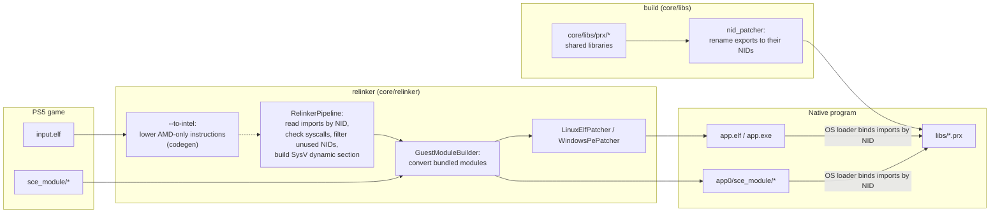
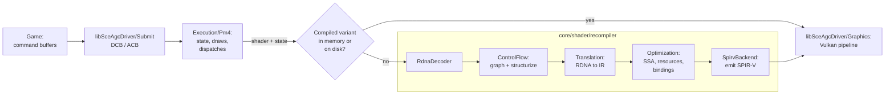

# Architecture

How a PS5 executable becomes a native Linux or Windows program. Nothing is emulated: the converted executable runs as a normal process and calls native implementations of the system libraries.

## Overview

- [`core/relinker/main.cpp`](../../core/relinker/main.cpp) runs the steps in this order. `--to-intel` is optional, see [USAGE.md](../user/USAGE.md).
- Each library in [`core/libs/prx`](../../core/libs/prx) builds as a shared library. After the build, `nid_patcher` ([`core/libs/nid`](../../core/libs/nid)) renames every export to its NID, computed from the function name. `APS5_EXPORT("<nid>", func)` sets the NID directly when the name is unknown.

## Thread cancellation

[`Thread.cpp`](../../core/libs/prx/libkernel/Pthread/src/Thread.cpp) records cancellation requests on the target guest thread. New threads start with cancellation enabled and deferred. A disabled request stays pending; enabling deferred cancellation returns before the next cancellation point acts on it. Repeated requests do not add cleanup invocations.

[`Cancel.hpp`](../../core/libs/prx/libkernel/Pthread/include/Cancel.hpp) connects condition, semaphore and join waits to the request. A canceled condition waiter reacquires its guest mutex before cleanup. Semaphore and join waits release their internal locks before exiting. A request pending on entry to a semaphore wait is acted on before consuming an available token; a canceled join leaves its target joinable and its result output untouched.

Cancellation exits through `scePthreadExit` with result pointer `1`. It runs cleanup handlers in reverse push order before thread-specific destructors; cancellation points inside cleanup must not start another exit. The host thread then terminates through the existing Windows or Linux lifecycle, and join waits for that termination. Host thread termination is not used to inject cancellation into a running guest frame.

The reference contract and constants come from FreeBSD libthr, pinned at [`5ed7eb0d`](https://github.com/freebsd/freebsd-src/blob/5ed7eb0d97ba4436218e810f61bd059acba984c2/lib/libthr/thread/thr_cancel.c), with cleanup and exit ordering in [`thr_exit.c`](https://github.com/freebsd/freebsd-src/blob/5ed7eb0d97ba4436218e810f61bd059acba984c2/lib/libthr/thread/thr_exit.c#L196-L259). These are reference semantics, not console measurements. The supported cancellation points and incomplete asynchronous behavior are listed in [TechnicalDebt](TechnicalDebt.md).

[`GuestPthreadCancelRecovery.cpp`](../../core/libs/tests/GuestPthreadCancelRecovery.cpp) checks pending requests before ordinary and timed semaphore acquisition, cleanup reentrancy and destructor ordering, enabled and disabled timed condition waits, canceled join output, and subsequent resource and thread reuse. Host atomic gates establish pending requests; acquiring the condition mutex after the worker releases it establishes wait entry without a scheduling sleep. Both `guest_pthread_cancel_recovery` and `guest_pthread_cancel_recovery_coarse` retain checks in Release and have a 20-second timeout, shorter than the 60-second guest waits. The latter sets `APS5_COARSE_TIMED_WAITS=1` to exercise the Windows fallback; Linux uses that condition-variable path by default.

## Graphics

- [`Recompiler.cpp`](../../core/shader/recompiler/Recompiler.cpp) runs the stages in this order. With `ANYPS5_ENABLE_SPIRV_TOOLS`, the SPIR-V is also validated and optimized with SPIRV-Tools.
- `ShaderRecompiler::Recompile` keeps compiled variants in memory, and `ShaderDiskCache` stores them on disk so later runs reuse them.
- A compute shader whose LDS plus its lock dword exceeds the host's `maxComputeSharedMemorySize` is not given a `Workgroup` array. `Recompile` sets `ShaderInfo::sharedMemoryBytes` for it and the SPIR-V backend addresses the LDS in a coherent storage buffer at descriptor set 1 (`WorkgroupMemoryDescriptorSet`), with a slice of `RecompileResult::workgroupMemoryDwords` per workgroup, indexed by `WorkgroupID` and `NumWorkGroups`. `VulkanDevice` keeps one such buffer, sized from the dispatch dimensions, and binds it after the resource set; programs that fit keep using shared memory.
- `Driver::RegisterShader` splits shader preparation in two. `PlanRegistered` runs on the registering guest thread: it validates the registers and entry point, decodes the code and builds the recompile request, so invalid registrations still fail there. The RDNA to IR translation and resource plan (`PrepareShader`) run on a background pool of `hardware_concurrency() / 2` detached threads (at least 2, 64 MiB stacks).
- The shader registry maps a code address to every header registered for that code, in registration order. Static, graphics and rectangle ABI resolution pick the header at the bound address (or one equal to it, `SameHeader`); draws and dispatches pick the program by the stage's binary type (`RegisteredProgram`), and a front entry matching both type 2 and type 4 throws. Within a type the last registration wins; re-registering an identical earlier header makes its snapshot current again without preparing it again, and changed code drops the older headers.
- The snapshot is published as pending. `SourceHandleFor`, `InvocationFor` and `ShaderPreparationTransaction::Edit` / `Read` wait for the pending job before reading `PreparedShaders`, and rethrow its failure. `APS5_SYNC_SHADER_PREPARE=1` prepares on the registering thread instead.
- A draw or dispatch whose state matches no artifact prepared at registration (a title that builds its static ABI state itself, without `sceAgcDriverResolve*Abi`) gets one prepared at use by `SourceHandleFor` or `InvocationFor`, logged once per artifact and kept in the snapshot for the next use.
- A draw's `Graphics::Pipeline` comes from `CachedPipeline`. When the device has `VK_EXT_graphics_pipeline_library` with fast linking, `VK_EXT_extended_dynamic_state` and `VK_KHR_dynamic_rendering`, draws render with `vkCmdBeginRenderingKHR` instead of render passes and the pipeline is linked from four libraries (vertex input, pre-rasterization shaders, fragment shader, fragment output) kept per device in [`PipelineLibrary.cpp`](../../core/libs/prx/libSceAgcDriver/Graphics/src/PipelineLibrary.cpp). A library built for one pipeline is reused by the next: another blend, vertex layout or target format builds only that part (the shader libraries name no attachment format), and cull mode, front face, depth and stencil state are dynamic, so changing them only links. The fast link is what the draw waits for; a background thread then links the same libraries with link-time optimization and the pipeline binds that one from the next draw on. Push constants then use a 256-byte block with a 128-byte slot per side: the pre-rasterization stages stack from byte 0, the pixel shader always starts at byte 128 (`StagePushOffset`), so its library does not depend on how much push data its vertex shader uses. Pipelines with per-face depth bias, rect lists, geometry shaders or a stage without a variant id are created whole, still with dynamic rendering; devices without the extensions (or with `APS5_NO_GPL=1`) keep render passes and whole pipelines.

### Shader MODE register access

`GuestContext::floatMode` carries the initial shader mode through `Recompile` and `TranslateOptions` into each block's `TranslationContext`. `s_getreg_b32` reads confined to MODE bits 0–3 return the selected initial rounding bits in the destination's low bits. Bits 0–1 select f32 rounding; bits 2–3 select f16/f64 rounding. Missing mode metadata retains the legacy round-to-nearest-even assumption. Reading other MODE fields or hardware registers throws.

An immediate MODE write confined to the rounding fields is accepted only when its selected replacement bits equal the initial state. Source bits above the selected width are ignored. `s_round_mode` similarly compares its low four immediate bits with the initial rounding fields. A state-changing write or an SGPR-sourced MODE write throws with its instruction and program counter. Runtime transitions require control-flow-aware mode tracking and matching arithmetic lowering. Writes to other hardware registers retain their existing behavior and remain technical debt.

The register layout and instruction contract follow [AMD RDNA2 ISA sections 5.8 and 6.4, Table 24](https://www.amd.com/content/dam/amd/en/documents/radeon-tech-docs/instruction-set-architectures/rdna2-shader-instruction-set-architecture.pdf), cross-checked against LLVM 20.1.8's [hardware-register encoding](https://github.com/llvm/llvm-project/blob/87f0227cb60147a26a1eeb4fb06e3b505e9c7261/llvm/lib/Target/AMDGPU/Utils/AMDGPUBaseInfo.h) and [MODE state analysis](https://github.com/llvm/llvm-project/blob/87f0227cb60147a26a1eeb4fb06e3b505e9c7261/llvm/lib/Target/AMDGPU/SIModeRegister.cpp). This contract does not establish arithmetic support for every initial mode or console-specific behavior.

`agc_shader_mode_register` decodes instruction words, builds the control-flow graph and checks production translation without a Vulkan device. It covers rounding subfield reads, masked constant writes, branches, unsupported runtime changes and diagnostics, plus mode propagation through full recompilation. The requirements remain active in Release; CTest bounds execution to 20 seconds.
