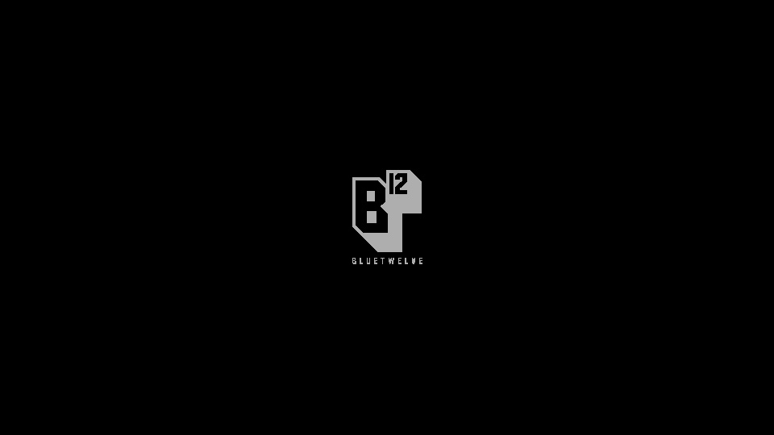
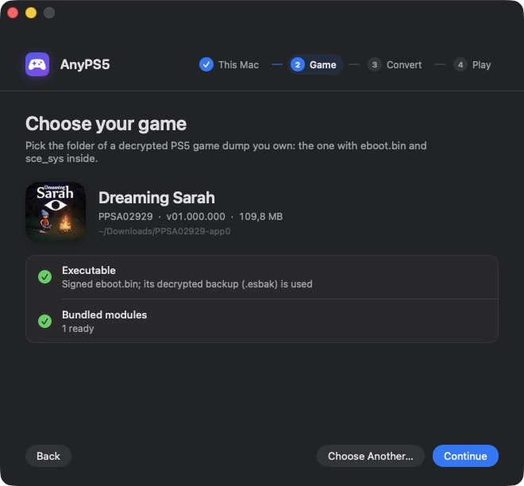
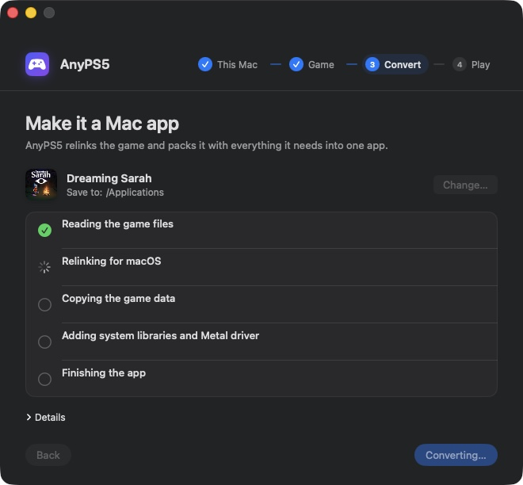
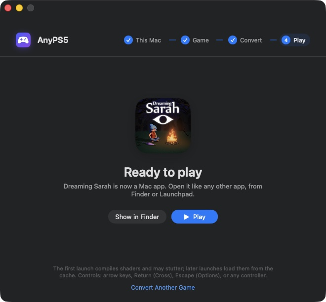

# AnyPS5-ARM guide

[English](#english) · [Türkçe](#türkçe)

---

## English

### Games that run

| Dreaming Sarah | AnyPS5 Breakout | Stray (WIP) |
|---|---|---|
|  |  |  |
| PPSA02929 · 60 fps, playable | Test title · 60 fps, video, pad and audio | PPSA02100 · Unreal Engine 4 · about 1 fps, **work in progress** |

All three run on a MacBook Pro M3 Pro with macOS 26.6.2.

#### Dreaming Sarah

The menu and gameplay run at 60 fps (about 18 fps before the macOS write watch).

| Main menu | Opening scene |
|---|---|
|  |  |

#### Stray: work in progress

Stray is the first Unreal Engine 4 title to render on macOS here. It boots through the studio logo to the brightness setup screen, at about 1 fps for now. Getting there took these fixes:

- larger shader image and sampler heaps
- a SPIR-V loop shape that MoltenVK's shader translator turned into an infinite loop and a GPU hang
- depth and stencil surfaces read as storage images
- draws the Metal backend cannot run (geometry shaders, the depth bounds test) skipped instead of stopping the game

It still needs `APS5_NO_WRITE_WATCH=1` and `ANYPS5_NO_SHADER_CACHE=1`, and stops later on a depth texture it cannot sample yet.

| Studio logo | Brightness setup |
|---|---|
|  |  |

### Compatibility

The [compatibility list](COMPATIBILITY.md) has every game tested on macOS, its status and its frame rate.

### Status

[](https://utkuhalis.github.io/AnyPS5-ARM/) [](https://utkuhalis.github.io/AnyPS5-ARM/)

[](https://utkuhalis.github.io/AnyPS5-ARM/)

<sub>* System libraries: the share of the functions the project knows so far (declared in [core/libs/prx](../../core/libs/prx)) that are implemented, not of every PS5 system function. GPU shader instructions: the share of the RDNA instructions the shader recompiler translates. Both are regenerated on every push to `main`.</sub>

| Check | Result |
|---|---|
| Guest fixtures (TLS, exceptions, threads, modules) | 10 of 10 pass |
| Test suite on MoltenVK | 477 of 484 pass |

Measured with Vulkan SDK 1.4.363.0. The 7 failing tests hit Apple GPU or Metal limits, such as 64-bit buffer atomics and 32 KiB threadgroup memory. [MACOS_PORT.md](../dev/MACOS_PORT.md) lists them, along with every change this fork makes.

### The AnyPS5 app

**AnyPS5.app** turns a game folder into a Mac app: no Terminal, no build, no Vulkan SDK.

<p><a href="https://github.com/utkuhalis/AnyPS5-ARM/releases/latest/download/AnyPS5-macOS.zip"><b>⬇ Download AnyPS5 for macOS</b></a> · Apple silicon · macOS 14+</p>

1. Download **AnyPS5-macOS.zip** from the [latest release](https://github.com/utkuhalis/AnyPS5-ARM/releases/latest), unzip it and move **AnyPS5.app** to Applications.
2. Open it. The app is not notarized, so the first time macOS blocks it. Open **System Settings → Privacy & Security** and click **Open Anyway**, or run `xattr -dr com.apple.quarantine /Applications/AnyPS5.app` once.
3. Follow the four steps:

| 1. Check this Mac | 2. Choose the game | 3. Convert | 4. Play |
|---|---|---|---|
| Checks Apple silicon and Rosetta 2, and installs Rosetta with one click if it is missing. | Drag the game folder onto the window or the Dock icon. Shows the game's icon, name and size, and catches a still-encrypted dump before you start. | Relinks the game and bundles the system libraries and the Metal driver into one app, in seconds. | Opens the game. From then on it starts like any other app. |

| Choose the game | Converting | Ready to play |
|---|---|---|
|  |  |  |

The app checks the folder before converting. If the dump's `eboot.bin` is signed but has a decrypted `.esbak` backup next to it, the backup is used. The converted game lands in `/Applications`, or in `~/Applications` if `/Applications` is not writable, and starts on its own from then on.

### About the project

AnyPS5-ARM is the macOS port of [AnyPS5](https://github.com/boykopovar/AnyPS5). AnyPS5 is not an emulator. Its relinker turns a PS5 executable into a native program, and its system libraries are reimplemented as ordinary shared libraries the program links against. This fork makes that work on Apple silicon:

- **CPU:** the game's x86-64 code runs under **Rosetta 2**. A [native arm64 mode](https://github.com/utkuhalis/AnyPS5-ARM/blob/native-arm64/docs/dev/NATIVE_ARM64.md) that translates the code ahead of time, with no Rosetta, is in development on the `native-arm64` branch.
- **Executable:** the relinker writes a **Mach-O** executable.
- **Graphics:** the PS5 graphics driver runs on **Vulkan through MoltenVK**, which runs on Metal.
- **Distribution:** the result is packaged as a normal **`.app`** you open from Finder.

### Building from source

#### Requirements

- A Mac with Apple silicon (M1 or newer)
- Rosetta 2: `softwareupdate --install-rosetta --agree-to-license`
- Xcode command-line tools: `xcode-select --install`
- CMake and Ninja: `brew install cmake ninja`
- The [Vulkan SDK for macOS](https://vulkan.lunarg.com/sdk/home#mac), which provides the Vulkan loader and MoltenVK
- A **decrypted dump of a game you own**. It needs a plain ELF executable; a signed SELF does not work.

#### 1. Build

```sh
git clone --recursive https://github.com/utkuhalis/AnyPS5-ARM.git
cd AnyPS5-ARM
cmake -S . -B build-mac -G Ninja -DCMAKE_BUILD_TYPE=Release -DCMAKE_OSX_ARCHITECTURES=x86_64
ninja -C build-mac all libs
```

`CMAKE_OSX_ARCHITECTURES=x86_64` is required, because the system libraries have to match the game's x86-64 code. The build produces:

- the relinker at `build-mac/core/relinker/relinker`
- the system libraries in `build-mac/core/libs/libs/`

#### 2. Convert a game

The dump folder holds the executable, its bundled modules and the game's data:

```text
MyGame/
    eboot.bin        decrypted ELF executable
    sce_module/      the game's bundled modules (libc.prx, ...)
    sce_sys/         param.json, icon0.png, ...
    ...              the game's data files
```

Relink the executable for macOS:

```sh
build-mac/core/relinker/relinker --macos --to-intel MyGame/eboot.bin out/eboot
```

- `--macos` writes a Mach-O executable.
- `--to-intel` rewrites the AMD-only instructions that Rosetta cannot run.
- The converted modules are written to `out/app0/sce_module/`.

#### 3. Package it as an app

```sh
python3 tools/package_macos_app.py \
    --relinked out \
    --game MyGame \
    --libs build-mac/core/libs/libs \
    --vulkan ~/VulkanSDK/<version>/macOS \
    "My Game.app"
```

The bundle contains everything it needs: the game, the system libraries, the Vulkan loader and MoltenVK. Its name and icon come from `sce_sys/param.json` and `icon0.png`. You can move it to `/Applications` and start it from Finder or Launchpad. The app is not signed: if macOS refuses to open it, right-click it and choose **Open** once.

To build AnyPS5.app itself from this build, run `tools/macos/build_converter_app.sh build-mac ~/VulkanSDK/<version>/macOS dist`.

#### 4. Play

| Keyboard / mouse | PS5 button |
|---|---|
| Arrow keys | D-pad |
| W A S D | Left stick |
| T F G H | Right stick |
| Return or Space | Cross |
| C | Circle |
| I | Triangle |
| Left click | Square |
| Q / E (or Alt) | L1 / R1 |
| Right click | R2 |
| Left Shift / Left Ctrl | L3 / R3 |
| Escape | Options |
| Backspace / Tab | Touchpad left / right |
| F11 | Toggle fullscreen |

Controllers that SDL recognizes, such as DualSense, DualShock and Xbox pads, work automatically. To change the keyboard and mouse bindings, see [INPUT_MAPPING.md](INPUT_MAPPING.md).

#### Troubleshooting

- **Log:** `~/Library/Logs/AnyPS5/<TITLE ID>.log`. When a game stops, the reason is at the end of this file. Unsupported states always end the program with an error message rather than continuing silently.
- **Shader cache:** `~/Library/Caches/org.anyps5.<title id>/shader_cache`. The first run compiles shaders, so it can stutter; later runs load them from the cache.
- **Performance profile:** start the executable from a terminal with `APS5_PROFILE_DRAW=1`. Every 10 seconds the log gets a `[present]` line with the number of frames drawn and the GPU time per frame.

#### Limitations

- The game's code runs under Rosetta 2. Apple has announced that macOS 27 is the last release with full Rosetta support.
- Games may stop at a function or GPU feature that is not implemented yet. See the [compatibility list](COMPATIBILITY.md).
- MoltenVK has no geometry shaders, mesh shaders, 64-bit atomics or 64-bit floats. Draws that need geometry or mesh shaders are skipped; shaders that need the others do not run.
- Known costs of the macOS port are listed in [TechnicalDebt.md](../dev/TechnicalDebt.md).

### Documentation

- [macOS port: status and changes](../dev/MACOS_PORT.md)
- [Native arm64 mode: design and plan](https://github.com/utkuhalis/AnyPS5-ARM/blob/native-arm64/docs/dev/NATIVE_ARM64.md)
- [Relinker usage](USAGE.md)
- [Input mapping](INPUT_MAPPING.md)
- [Architecture](../dev/ARCHITECTURE.md)
- [Technical debt](../dev/TechnicalDebt.md)
- [Code conventions](../dev/CONVENTIONS.md)

### Credits

- [boykopovar/AnyPS5](https://github.com/boykopovar/AnyPS5): the relinker, the system libraries and the shader recompiler this fork is built on.
- [mugurc/AnyPS5 `macos-port`](https://github.com/mugurc/AnyPS5/tree/macos-port): the community macOS port that added Mach-O output, merged here.

---

## Türkçe

### Çalışan oyunlar

| Dreaming Sarah | AnyPS5 Breakout | Stray (geliştiriliyor) |
|---|---|---|
|  |  |  |
| PPSA02929 · 60 FPS, oynanabilir | Test oyunu · 60 FPS, görüntü, kol ve ses | PPSA02100 · Unreal Engine 4 · yaklaşık 1 FPS, **üzerinde çalışılıyor** |

Üçü de macOS 26.6.2 çalışan bir MacBook Pro M3 Pro'da çalışıyor.

#### Dreaming Sarah

Menü ve oynanış 60 FPS'te çalışıyor (macOS yazma izleme eklenmeden önce yaklaşık 18 FPS).

| Ana menü | Açılış sahnesi |
|---|---|
|  |  |

#### Stray: üzerinde çalışılıyor

Stray, burada macOS'ta görüntü veren ilk Unreal Engine 4 oyunu. Stüdyo logosundan parlaklık ayar ekranına kadar açılıyor, şimdilik yaklaşık 1 FPS ile. Bunun için şu düzeltmeler yapıldı:

- daha büyük shader image ve sampler heap'leri
- MoltenVK'nın shader çeviricisinin sonsuz döngüye ve GPU kilitlenmesine çevirdiği bir SPIR-V döngü biçimi
- storage image olarak okunan depth ve stencil yüzeyleri
- Metal'in çalıştıramadığı çizimlerin (geometry shader'lar, depth bounds testi) oyunu durdurmak yerine atlanması

Hâlâ `APS5_NO_WRITE_WATCH=1` ve `ANYPS5_NO_SHADER_CACHE=1` gerekiyor ve daha ileride henüz örnekleyemediği bir depth texture'da duruyor.

| Stüdyo logosu | Parlaklık ayarı |
|---|---|
|  |  |

### Uyumluluk

[Uyumluluk listesi](COMPATIBILITY.md#türkçe), macOS'ta test edilen her oyunu, durumunu ve FPS'ini gösterir.

### Durum

[](https://utkuhalis.github.io/AnyPS5-ARM/) [](https://utkuhalis.github.io/AnyPS5-ARM/)

[](https://utkuhalis.github.io/AnyPS5-ARM/)

<sub>* Sistem kütüphaneleri: projenin şimdiye kadar bildiği fonksiyonların ([core/libs/prx](../../core/libs/prx) içinde tanımlananlar) ne kadarının yazıldığı; PS5'in bütün sistem fonksiyonlarının değil. GPU shader komutları: shader derleyicisinin çevirebildiği RDNA komutlarının oranı. İkisi de `main`'e her push'ta yeniden üretilir.</sub>

| Kontrol | Sonuç |
|---|---|
| Misafir testleri (TLS, istisnalar, thread'ler, modüller) | 10/10 geçiyor |
| MoltenVK üzerinde test paketi | 484 testin 477'si geçiyor |

Ölçümler Vulkan SDK 1.4.363.0 ile yapıldı. Geçmeyen 7 test, Apple GPU'sunun veya Metal'in sınırlarına takılıyor; örneğin 64-bit buffer atomikleri ve 32 KiB threadgroup belleği. [MACOS_PORT.md](../dev/MACOS_PORT.md) bu testleri ve bu fork'un yaptığı tüm değişiklikleri listeler.

### AnyPS5 uygulaması

**AnyPS5.app**, oyun klasörünü bir Mac uygulamasına dönüştürür: Terminal, derleme ya da Vulkan SDK gerekmez.

<p><a href="https://github.com/utkuhalis/AnyPS5-ARM/releases/latest/download/AnyPS5-macOS.zip"><b>⬇ AnyPS5'i indir</b></a> · Apple silicon · macOS 14+</p>

1. [Son sürümden](https://github.com/utkuhalis/AnyPS5-ARM/releases/latest) **AnyPS5-macOS.zip** dosyasını indir, zip'i aç ve **AnyPS5.app**'i Uygulamalar klasörüne taşı.
2. Aç. Uygulama Apple tarafından onaylanmadığı (notarize edilmediği) için macOS ilk seferde engeller. **Sistem Ayarları → Gizlilik ve Güvenlik**'e gidip **Yine de Aç**'a tıkla ya da bir kere `xattr -dr com.apple.quarantine /Applications/AnyPS5.app` çalıştır.
3. Dört adımı takip et:

| 1. Bu Mac | 2. Oyunu seç | 3. Dönüştür | 4. Oyna |
|---|---|---|---|
| Apple silicon ve Rosetta 2'yi kontrol eder; Rosetta yoksa tek tıkla kurar. | Oyun klasörünü pencereye ya da Dock'taki simgeye sürükle. Oyunun simgesini, adını ve boyutunu gösterir; dump hâlâ şifreliyse başlamadan uyarır. | Oyunu relink eder; sistem kütüphanelerini ve Metal sürücüsünü tek bir uygulamada toplar, birkaç saniyede. | Oyunu açar. Bundan sonra diğer uygulamalar gibi açılır. |

| Oyunu seç | Dönüştürülüyor | Oynamaya hazır |
|---|---|---|
|  |  |  |

Uygulama, dönüştürmeden önce klasörü kontrol eder. Dump'taki `eboot.bin` imzalıysa ama yanında şifresi çözülmüş bir `.esbak` yedeği varsa, o yedek kullanılır. Dönüştürülen oyun `/Applications` klasörüne kaydedilir; oraya yazılamıyorsa `~/Applications` kullanılır. Bundan sonra oyunu doğrudan açabilirsin.

### Proje hakkında

AnyPS5-ARM, [AnyPS5](https://github.com/boykopovar/AnyPS5)'in macOS sürümüdür. AnyPS5 bir emülatör değildir. Relinker'ı PS5 oyun dosyasını yerel bir programa dönüştürür. Sistem kütüphaneleri de yeniden yazılmıştır ve program bunlara normal paylaşımlı kütüphaneler gibi bağlanır. Bu fork, bunu Apple silicon'da çalışır hale getirir:

- **İşlemci:** Oyunun x86-64 kodu **Rosetta 2** altında çalışır. Kodu önceden arm64'e çeviren ve Rosetta gerektirmeyen bir [native arm64 modu](https://github.com/utkuhalis/AnyPS5-ARM/blob/native-arm64/docs/dev/NATIVE_ARM64.md), `native-arm64` dalında geliştiriliyor.
- **Çalıştırılabilir dosya:** Relinker, oyunu bir **Mach-O** dosyası olarak yazar.
- **Grafik:** PS5 grafik sürücüsü, **MoltenVK üzerinden Vulkan** ile çalışır. MoltenVK da Metal'i kullanır.
- **Dağıtım:** Sonuç, Finder'dan açılan normal bir **`.app`** olarak paketlenir.

### Kaynak koddan derleme

#### Gereksinimler

- Apple silicon işlemcili bir Mac (M1 veya daha yenisi)
- Rosetta 2: `softwareupdate --install-rosetta --agree-to-license`
- Xcode komut satırı araçları: `xcode-select --install`
- CMake ve Ninja: `brew install cmake ninja`
- [macOS için Vulkan SDK](https://vulkan.lunarg.com/sdk/home#mac); Vulkan yükleyicisini ve MoltenVK'yi sağlar
- **Sahip olduğun bir oyunun şifresi çözülmüş dump'ı.** Çalıştırılabilir dosya düz bir ELF olmalı; imzalı SELF çalışmaz.

#### 1. Derleme

```sh
git clone --recursive https://github.com/utkuhalis/AnyPS5-ARM.git
cd AnyPS5-ARM
cmake -S . -B build-mac -G Ninja -DCMAKE_BUILD_TYPE=Release -DCMAKE_OSX_ARCHITECTURES=x86_64
ninja -C build-mac all libs
```

`CMAKE_OSX_ARCHITECTURES=x86_64` zorunlu, çünkü sistem kütüphanelerinin oyunun x86-64 koduyla aynı mimaride olması gerekiyor. Derleme şunları üretir:

- relinker: `build-mac/core/relinker/relinker`
- sistem kütüphaneleri: `build-mac/core/libs/libs/`

#### 2. Oyunu dönüştürme

Dump klasöründe çalıştırılabilir dosya, oyunla gelen modüller ve oyunun verileri bulunur:

```text
MyGame/
    eboot.bin        şifresi çözülmüş ELF
    sce_module/      oyunla gelen modüller (libc.prx, ...)
    sce_sys/         param.json, icon0.png, ...
    ...              oyunun veri dosyaları
```

Çalıştırılabilir dosyayı macOS için dönüştür:

```sh
build-mac/core/relinker/relinker --macos --to-intel MyGame/eboot.bin out/eboot
```

- `--macos`, Mach-O dosyası üretir.
- `--to-intel`, Rosetta'nın çalıştıramadığı AMD'ye özel komutları dönüştürür.
- Dönüştürülen modüller `out/app0/sce_module/` klasörüne yazılır.

#### 3. Uygulama olarak paketleme

```sh
python3 tools/package_macos_app.py \
    --relinked out \
    --game MyGame \
    --libs build-mac/core/libs/libs \
    --vulkan ~/VulkanSDK/<sürüm>/macOS \
    "My Game.app"
```

Paket, çalışmak için gereken her şeyi içerir: oyun, sistem kütüphaneleri, Vulkan yükleyicisi ve MoltenVK. Adı ve simgesi `sce_sys/param.json` ile `icon0.png`'den alınır. Uygulamayı `/Applications` klasörüne taşıyıp Finder'dan ya da Launchpad'den açabilirsin. Uygulama imzasız: macOS açmayı reddederse, uygulamaya sağ tıklayıp bir kere **Aç**'ı seç.

AnyPS5.app'in kendisini bu derlemeden üretmek için `tools/macos/build_converter_app.sh build-mac ~/VulkanSDK/<sürüm>/macOS dist` çalıştır.

#### 4. Oynama

| Klavye / fare | PS5 tuşu |
|---|---|
| Yön tuşları | D-pad |
| W A S D | Sol analog |
| T F G H | Sağ analog |
| Return veya Space | Çarpı (Cross) |
| C | Daire (Circle) |
| I | Üçgen (Triangle) |
| Sol tık | Kare (Square) |
| Q / E (veya Alt) | L1 / R1 |
| Sağ tık | R2 |
| Sol Shift / Sol Ctrl | L3 / R3 |
| Escape | Options |
| Backspace / Tab | Touchpad sol / sağ |
| F11 | Tam ekran aç/kapat |

SDL'in tanıdığı kollar (DualSense, DualShock, Xbox kolları gibi) kendiliğinden çalışır. Klavye ve fare tuşlarını değiştirmek için [INPUT_MAPPING.md](INPUT_MAPPING.md) dosyasına bak.

#### Sorun giderme

- **Log:** `~/Library/Logs/AnyPS5/<TITLE ID>.log`. Oyun kapanırsa sebebi bu dosyanın sonunda yazar. Desteklenmeyen bir durumda program sessizce devam etmez, her zaman bir hata mesajıyla kapanır.
- **Shader önbelleği:** `~/Library/Caches/org.anyps5.<title id>/shader_cache`. İlk açılışta shader'lar derlendiği için takılmalar olabilir; sonraki açılışlarda önbellekten yüklenir.
- **Performans ölçümü:** Çalıştırılabilir dosyayı terminalden `APS5_PROFILE_DRAW=1` ile başlat. Log dosyasına her 10 saniyede bir `[present]` satırı düşer; bu satırda çizilen kare sayısı ve kare başına GPU süresi yazar.

#### Sınırlamalar

- Oyun kodu Rosetta 2 altında çalışıyor. Apple, macOS 27'nin tam Rosetta desteği olan son sürüm olacağını duyurdu.
- Oyunlar henüz yazılmamış bir fonksiyona ya da GPU özelliğine takılıp durabilir. [Uyumluluk listesine](COMPATIBILITY.md#türkçe) bak.
- MoltenVK'de geometry shader, mesh shader, 64-bit atomic ve 64-bit float yok. Geometry ya da mesh shader gerektiren çizimler atlanır; diğerlerini gerektiren shader'lar çalışmaz.
- macOS sürümünün bilinen maliyetleri [TechnicalDebt.md](../dev/TechnicalDebt.md) dosyasında listelenir.

### Belgeler

- [macOS sürümü: durum ve değişiklikler](../dev/MACOS_PORT.md)
- [Native arm64 modu: tasarım ve plan](https://github.com/utkuhalis/AnyPS5-ARM/blob/native-arm64/docs/dev/NATIVE_ARM64.md)
- [Relinker kullanımı](USAGE.md)
- [Tuş atamaları](INPUT_MAPPING.md)
- [Mimari](../dev/ARCHITECTURE.md)
- [Teknik borç](../dev/TechnicalDebt.md)
- [Kod kuralları](../dev/CONVENTIONS.md)

### Teşekkürler

- [boykopovar/AnyPS5](https://github.com/boykopovar/AnyPS5): Bu fork'un temeli olan relinker, sistem kütüphaneleri ve shader derleyicisi.
- [mugurc/AnyPS5 `macos-port`](https://github.com/mugurc/AnyPS5/tree/macos-port): Mach-O çıktısını ekleyen topluluk macOS sürümü; buraya birleştirildi.
